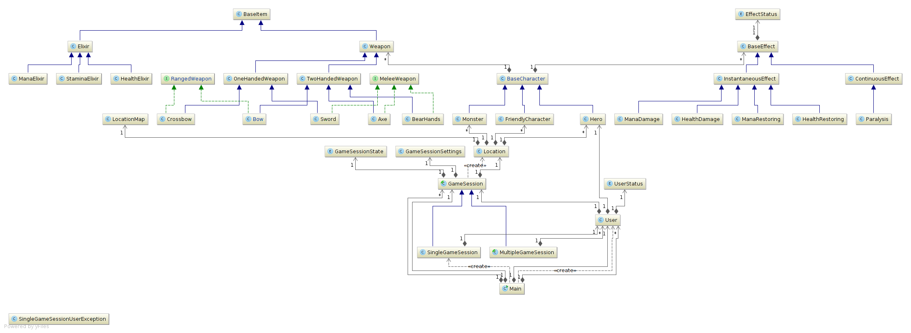

#LandOfAdvantures#

## Опис ##
Клієнт-серверна 2-d гра на WebSocket та WebGL

Опис програми: Комп'ютерна гра з 2-d графікою. Гравець керує головним героєм, мета якого проходити рівні: вбивати монстрів, дойти до кінцевого пункту призначення і витратити на це наменшу кількість часу. Гра містить три види режимів:
- зачистити все(знайти і знищити всіх монстрів на карті);
- пробігти рівень за час(затратити найменшу кількість часу для проходження рівня);
- вижити(витримати сильний натиск монстрів);

Для проходження цих рівнів герой має: різні види зброї, еліксири та навички. Навички з кожним рівнем героя покращуються. 
Герой отримує досвід за вбивства монстрів і проходження рівнів. Після отримання нового рівня героєм, монстри теж змінюються: 
стають сильнішими і більш витривалими.
Вся логіка гри буде прописана на веб-сервері.
Також в грі буде мультиплеєр, тобто буде можливість декільком гравцям грати одночасно.

#### Діаграма класів ####

## Автори ##
Група КМ - 23:
 * [Москаль Олексій(OMosk)] (https://github.com/OMosk) 
 * [Тарас Рудник(TarasRudnyk)] (https://github.com/TarasRudnyk)
 * [Сергієнко Юлія(Juliesergienko)] (https://github.com/Juliesergienko)
